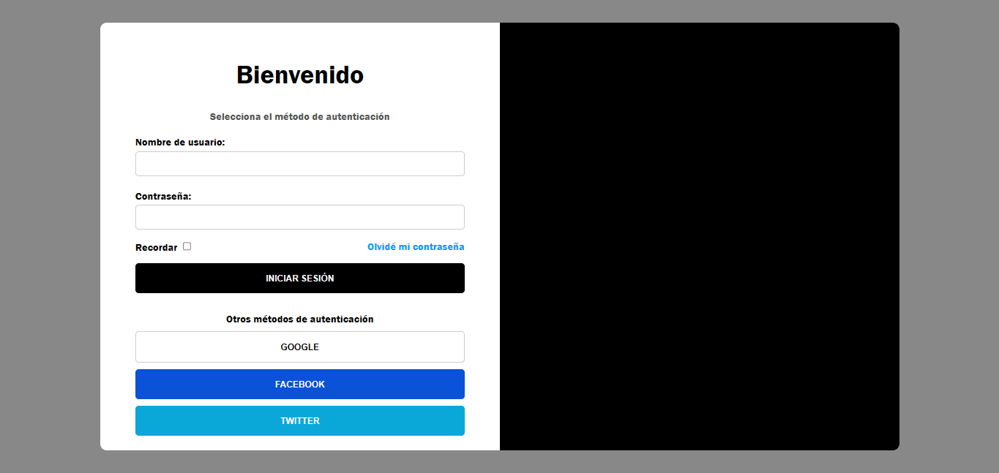
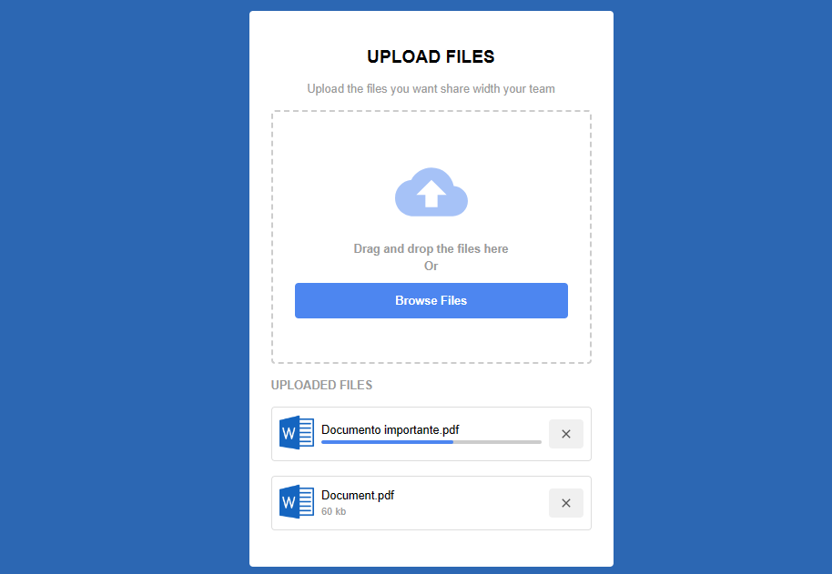
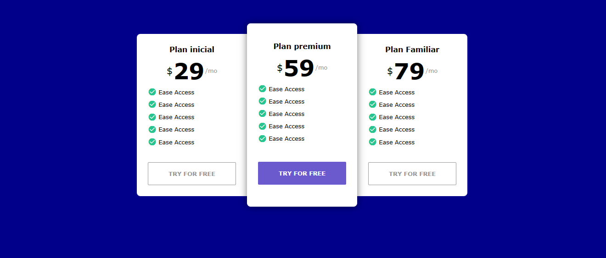

# 8 proyectos con HTML y CSS

## Tecnologías Utilizadas

Estos 8 proyectos son:
- Barra de búsqueda personalizada
- Menú de navegación horizontal
- Barra de progreso
- Formulario de Login
- Menú de navegación vertical
- Drag o drop
- Tabla de precios
- Tarjetas 3D

## Barra de búsqueda personalizada

## Menú de navegación horizontal

## Barra de progreso

https://github.com/Nicole-Palomino/proyectos-css/assets/83719595/0bab4e57-66ef-4561-9361-31361a9204c9

## Formulario de Login

## Menú de navegación vertical

https://github.com/Nicole-Palomino/proyectos-css/assets/83719595/f5ba0049-d954-44fd-b932-4b854764c1dd

## Drag o drop

## Tabla de precios

## Tarjetas 3

https://github.com/Nicole-Palomino/proyectos-css/assets/83719595/4d2d3e7c-dc90-4961-90e8-e09239b65460

