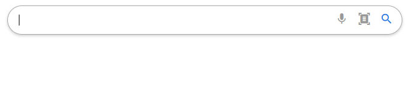
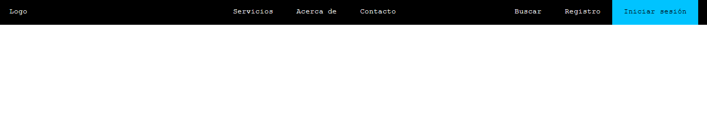

# 8 proyectos con HTML y CSS

## Tecnologías Utilizadas

Estos 8 proyectos son:
- Barra de búsqueda personalizada
- Menú de navegación horizontal
- Barra de progreso
- Formulario de Login
- Menú de navegación vertical
- Drag o drop
- Tabla de precios
- Tarjetas 3D

## Barra de búsqueda personalizada

## Menú de navegación horizontal

## Barra de progreso

## Formulario de Login

## Menú de navegación vertical

## Drag o drop

## Tabla de precios

## Tarjetas 3D
